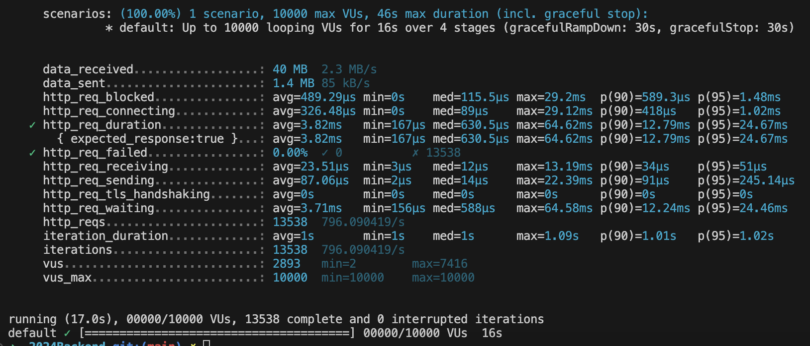

# 2024Backend
## 使用說明
1. 使用docker-compose安裝mysql, phpMyAdmin, redis, rabbitMQ
首先需要安裝`docker`
進入到`./deplotment`目錄運行以下指令
```
docker-compose up
```
之後要關閉請使用
```
docker-compose down
```
想查看資料庫可以到`http://localhost:8081`登入查看(phpMyAdmin)

帳號`ads_user`

密碼`ads_password`

2. 開啟server
進入到目錄下使用`go run main.go`開啟server

3. 快速產生資料（若有需要）
進入到`./data`資料夾下，運行`go run data.go`。</br>
會產生約1000筆活躍廣告以及約1萬筆非活躍廣告，方便做後續的操作

4. 使用postman, curl等方式測試API（或者直接跳到第六步進行test）

`POST`建立新廣告

URL:`127.0.0.1:8080/api/v1/ad`

Body:
```json
{
  "title": "AD 55",
  "startAt": "2024-04-01",
  "endAt": "2024-05-30",
  "condition": {
    "ageStart": 20,
    "ageEnd": 30,
    "gender": "M",
    "country": ["TW","US"],
    "platform": ["web"]
  }
}
```


`GET`取得當前活躍廣告

URL:`127.0.0.1:8080/api/v1/ad`


5. 使用K6或者其他壓力測試軟體測試API
如果是mac可以使用homebrew安裝K6
```
brew install k6
```

使用以下指令進行壓力測試`k6 run stress_test.js`

測試URL:`http://127.0.0.1:8080/api/v1/ad?offset=0&limit=10`

測試分為四個階段，最後一階段一秒鐘發送一萬個request

```
stages: [
        { duration: "5s", target: 10 },
        { duration: "5s", target: 100 },
        { duration: "5s", target: 1000 },
        { duration: "1s", target: 10000 },
      ]
```

本地測試結果如下：


該測試假設10000 request per second非常態事件，若為常態事件，可能會需要加上Message Queue以及實現分散式部署來減輕壓力。


6. unit test
進到根目錄下運行`go test`


## 想法以及設計上的選擇

1. 框架選擇
- Gin
    - 擁有大量開發資源
    - 有完善的MiddleWare，可以降低開發難度
    - 輕量Web框架，適合小專案
- Fiber
    - 速度最快

原本想同時做Fiber和Gin的比較，但是因為時間因素只有做完Gin


2. 資料庫選擇
- SQLite
    - 優點：輕量、不需要安裝、不需要伺服器
    - 缺點：多線程讀寫性能不理想
    - 場景：如本地應用。不適合用在每秒處理10000 request的場景
- MySQL vs PostgreSQL（參考[AWS：MySQL 與 PostgreSQL 之間有什麼區別](https://aws.amazon.com/tw/compare/the-difference-between-mysql-vs-postgresql/)）
    - MySQL不提供並行控制（可建立record的重複副本，安全地平行讀取和更新相同的資料）
    - MySQL是關連式資料庫，PostgreSQL是物件型關聯式資料庫，能以具有屬性的物件來存放資料，更直覺
    - PostgreSQL提供進階檢視選項，可以改善複雜查詢的資料庫效能
    - 應用範圍：**PostgreSQL 更適合具有頻繁寫入操作和複雜查詢的企業級應用程式。**
    - 效能需求：**如果您的應用程式需要頻繁的資料更新，則 PostgreSQL 會是更好的選擇。但是，如果您需要頻繁的資料讀取，則 MySQL 是首選。**
根據需求來看，查詢的操作會比較多，所以使用MySQL

3. cache如何進行設計
    - 使用redis
    - redis無法直接緩存POST請求，所以只緩存GET的部分，第一次請求時間約為20ms，之後的請求時間約在1ms上下

4. 壓力測試選擇
    - JMeter
    - K6
    - Locust
原本想使用現成的JMeter，但是Java出了點問題，所以就改用聽說效能更好的K6了


